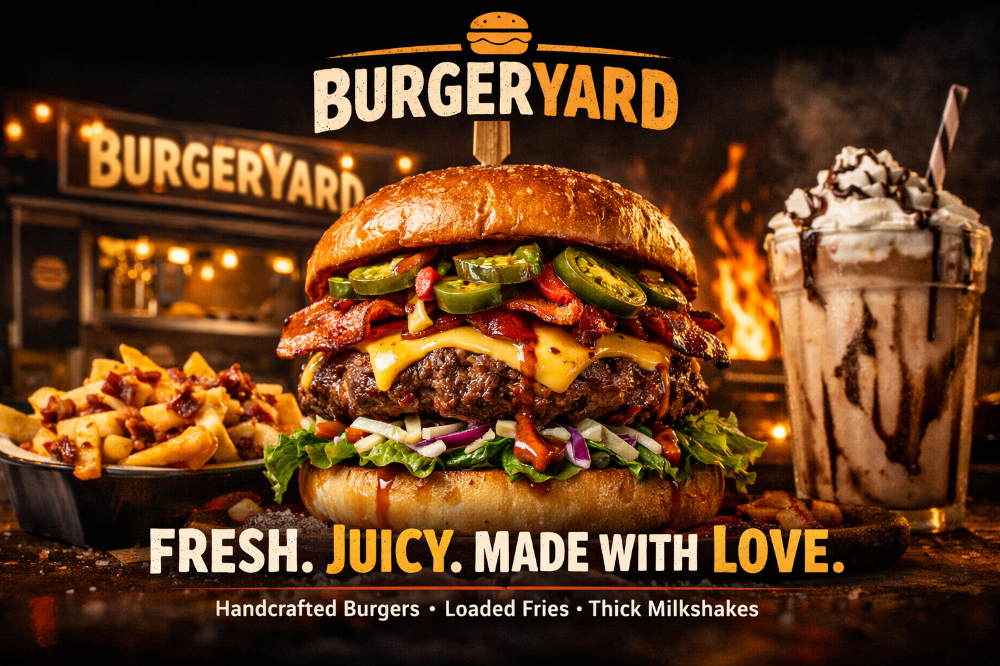

# Burger Yard


## Table of Contents
- [Introduction](#introduction)
- [Features](#features)
- [technologies Used](#Technologies-used)
- [How to Use](#How-to-Use)
- [Usage](#Usage)
- [Project Structure](#Project-Structure)
- [Contributing](#Contributing)
- [License](#License)
- [Contact](#Contact)
## Introduction


[Visit My Live Website](https://react-burger-theta-five.vercel.app/)
## Features
- **Responsive Design**: Optimized for all the devices, including Desktops,Tablets and Mobile phones.
- **Multipage Application**: This website is build using multipage app structiure. The code base for the multipage appliction is deployed also
the code is available in `spa` branch

## Technologies Used
- **Frontend**:
    - Html
    - CSS3
    - React JS
    - javaScript
- **Backend**:
- **Datase**:
- **Deployement**:
    - Vercel

## How to Use
To Set up this project in your device locally, please follow the Setps
1. **Clone Repsoitory**:
run the following command in your terminal:
>``````
git clone https://github.com/bhaskarajmeera/react_burger.git
````````
2. **Navigate to the Project Directory**:
>```
cd react_burger
```
3. **Install Dependancies**
>```
yarn
```
4. **Run the development server**
>```
yarn dev
```

Note: if your not using  `yarn`, you must install it golbally .To Install `yarn` Globally, run the following command `npm i yarn -g`

## Usage

## Project Structure
```
react_burger
|-- public
|-- src
|   |-- components
|   |   |-- About.jsx
|   |   |-- Cart.jsx
|   |   |-- Contact.jsx
|   |   |-- Footer.jsx
|   |   |-- Hero.jsx
|   |   |-- Menu.jsx
|   |   |-- Navbar.jsx
|   |-- Assets
|   |   |-- Hero.png
|   |   |-- logo.jpg
|   |   |-- milkshake.png
|   |   |-- navbarlogo.png
|   |   |-- yardspecial.png

```
## Contributing

## License

## Contact


1. Created a react vite burger app
2. Clean up all data 
3. Added cdns
4. created HTML and CSS for burger website 
5. created all components as assumed 
6. git second committ 

